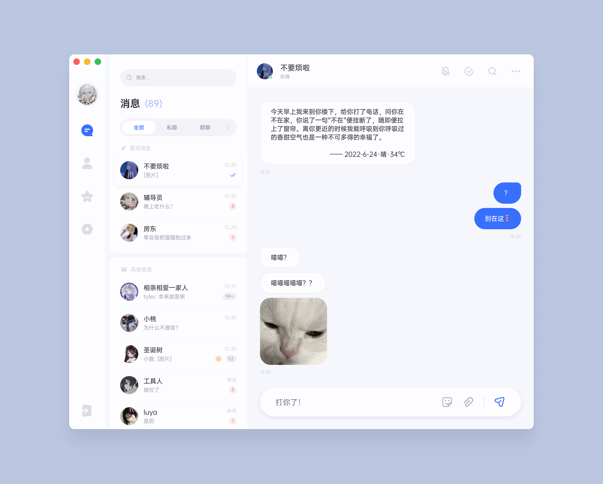
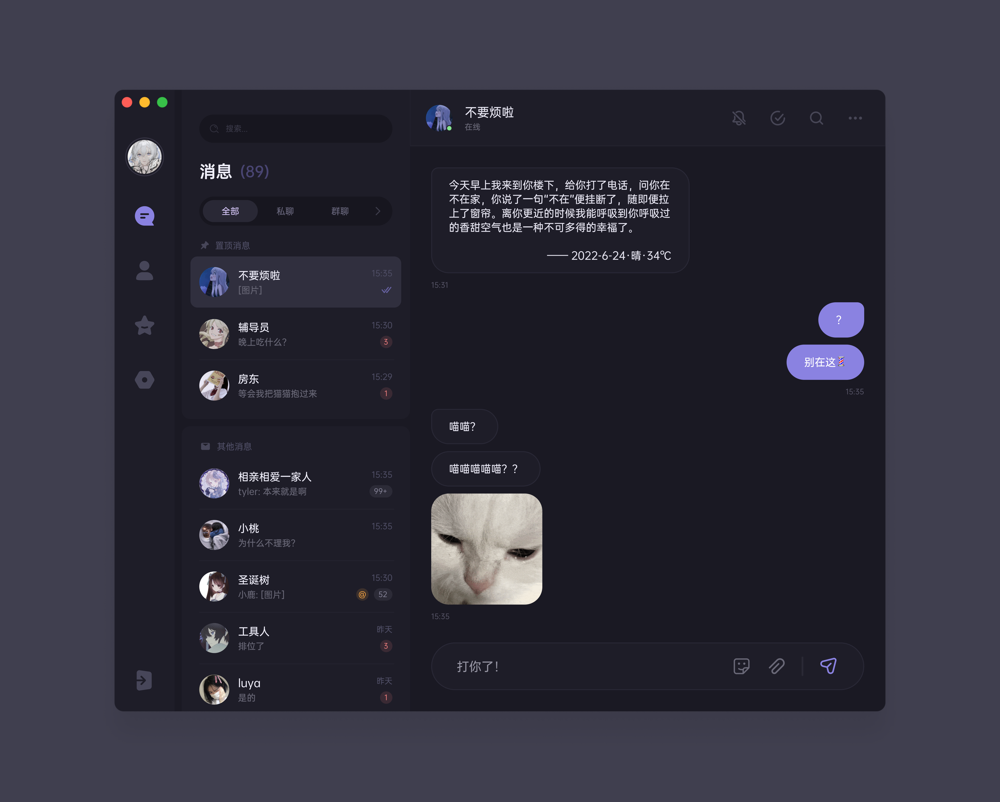
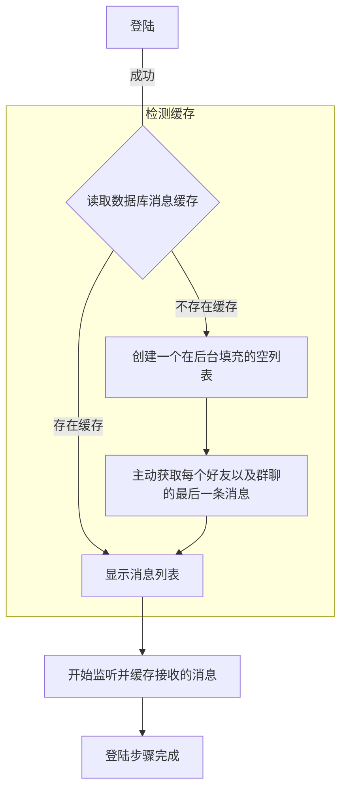

> 桌面 QQ 客户端**复活计划**
>
> ~~是的没错，这是又一个第三方 QQ！~~ 现在只是一个**计划，还没有开始**

## 概念

##### ▲ 亮色设计图

------

##### ▲ 暗色设计图

## 动机

我认为 macOS 上的 QQ 客户端太糟糕了。

> 曾经带给我希望的 catalyst 版本在 0202 年底被抛弃了，而 mac 商店版本都 2202 年了还不添加夜间模式，大晚上所有 App 都是黑色的就这个破 QQ 还是亮色，🥷听了都忍不了
>
> ------
>
> 近期在玩 [mirai](https://github.com/mamoe/mirai) 机器人时偶然发现了 [oicq](https://github.com/takayama-lily/oicq) 存在一个 **vscode** 版本的 ~~QQ 客户端~~ [vscode-qq](https://github.com/takayama-lily/vscode-qq)；并借此线索发现了另一个同样基于 **oicq** 的第三方 QQ 客户端 [Icalingua++](https://github.com/Icalingua-plus-plus/Icalingua-plus-plus). 经过体验后发现几乎可以满足日常使用，但还有一些地方不适合我自己，本着~~我行我上~~的想法决定自给自足了😨，但因为不熟悉也不想写 **typescript** 的原因贡献不了，所以创建这个项目的想法诞生了。

## 想法记录

> PS: 以下想法纯粹是为了避免在开始这个项目时遗忘而记录的

#### UI

- 使用 [**Compose**](https://github.com/JetBrains/compose-jb)

  > 缺少：
  >
  > 1. 一个易用像 coil 一样的图片加载框架
  >
  > 2. 一个“能用”的视频播放框架
  > 3. 一个用于加载网页的 webview 框架
  >
  > 以上这些在 compose 甚至 swing/javafx 体系中似乎并不存在广泛的流行库，也许只能用很古老的内置解决组件，或者找到一种办法和系统互操作以使用 macOS/Windows 中的原生视图

- 使用 [**Flutter**](https://flutter.dev/)

  > 问题：
  >
  > 1. Flutter 的桌面支持似乎不太友好
  > 2. Dart 是我蛮讨厌的糟糕语言
  >
  > 优势：
  >
  > 1. 生态完善，几乎所有需要用到的东西都存在
  > 2. 性能似乎也不错

- 使用 [**React Native**](https://reactnative.dev/) 或者 [**Electron**](https://www.electronjs.org/)

  > 虽然似乎很好，但是不想用 ts/js 写前端

*目前倾向于 **Compose***

#### 协议

- 使用 [**oicq**](https://github.com/takayama-lily/oicq)

  > 似乎是专注于协议的库，目前协议比 mirai 更丰富，作为客户端来说是一个很好的选择
  >
  > 但是缺少这方面的经验所以使用上存在一些难点：
  >
  > - 开发主语言不是 TypeScript 的话没法直接调用 Client API，不是很懂 JVM/Dart 要怎样和 TypeScript 通信，可能需要一个 JVM/Dart 的 node.js 运行时？
  > - 或者部署作为一个 HTTP API 后端使用，这样似乎简单一些。但部署后端可能需要服务器，或者在安装时在本地手动部署一次（应该可以做一个脚本之类的 "Installer" 完成）

  > 可能有帮助的：
  >
  > <https://www.graalvm.org/22.1/reference-manual/js/JavaInteroperability/>
  >
  > <https://github.com/eclipsesource/J2V8>
  >
  > <https://github.com/caoccao/Javet>
  >
  > <https://stackoverflow.com/questions/14275479/calling-a-node-js-script-from-inside-java>

- 使用 [**ricq**](https://github.com/lz1998/ricq)

  > 协议还没调研全面，不知道都够不够用（已知缺少表情漫游），但是胜在和其他语言互操作方便

- 使用 [**mirai**](https://github.com/mamoe/mirai)

  > 几乎是想法诞生之初的首选，因为是最爱的 Kotlin
  >
  > 但作为开发 bot 来说很好，但对于开发客户端来说的话还缺少一些东西：
  >
  > - - [ ] 获取收藏的漫游表情
  > - - [ ] 获取 Cookie，意味着 QQ 有一些已经存在的好用 Web API 都无法直接使用
  > - - [ ] 一些必备(?) 的主动 API: 例如修改昵称、修改头像等
  > - - [ ] 好友文件协议：<https://github.com/mamoe/mirai/issues/1416>
  > - - [ ] 历史消息相关协议：<https://github.com/mamoe/mirai/pull/1520> <https://github.com/project-mirai/mirai-api-http/issues/338>
  > - - [ ] 缺少视频相关协议：<https://github.com/mamoe/mirai/issues/1664> <https://github.com/mamoe/mirai/issues/867>
  >

  > 作为解决方案，也许可以
  >
  > - 将 mirai 同步为子模块以修改不满足的部分（但我太菜了，完全不懂协议，需要漫长的学习时间）
  >
  > - 找到一种可以让多个协议库协同运行的办法，这样就可以用其他协议库来补全 mirai 缺失的 API 了，例如 oicq 就不存在上面的问题
  >
  >   
  >
  > （但是好麻烦啊好麻烦

*综上所述解决了问题后 **oicq** 用来做客户端是目前最好的选择*

## 思路

但也许第一次来说显示一个空列表就够了，官方客户端似乎也是这样的行为？

> and more...

## 留言

想法很多，精力很少；创建这个项目纯属心血来潮，因此这会是一个哪天有空了就写一点的长期蜗牛项目。

同时欢迎任何感兴趣和有能力的大佬来一起复活 QQ for desktop, 可以在 issue 或 [tg@chachako](https://t.me/chachako) 和我交流想法

